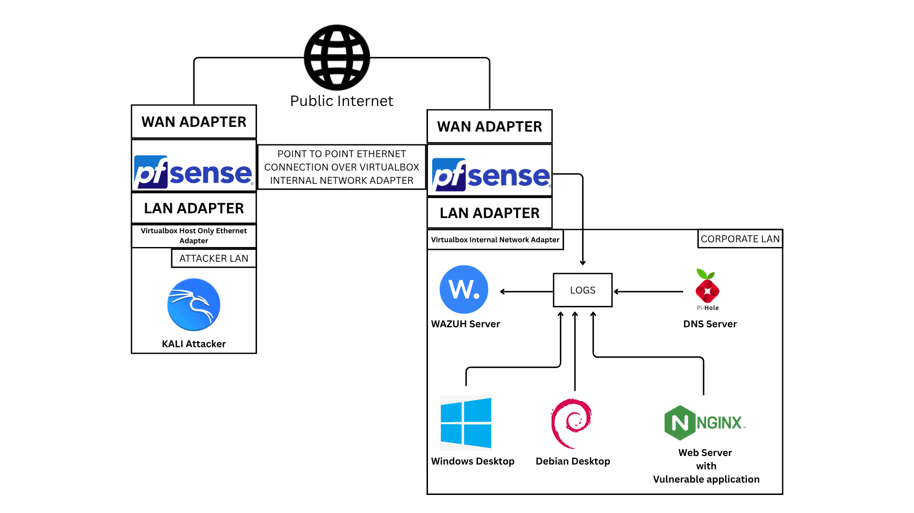

# SIEM Home Lab - Wazuh

## Objectives

1. Setup Wazuh server
2. Deploy Wazuh agents in Windows and Debian (desktop)
3. Set up File Integrity Monitoring in Windows
4. Set up default OS monitoring in Debian
5. Generate some logs by doing file edits in Windows (in the folder being monitored), sudo to ROOT escalation in Debian, and SSH brute forcing of Debian from a separate Kali VM
6. View the logs in Wazuh dashboard, and filter them based on queries

## Network Architecture

### List of VMs

1. pfSense VM as corporate LAN router
2. Wazuh server in Ubuntu VM
3. Windows user desktop VM
4. Debian admin desktop VM
5. pfSense VM as attacker's LAN router
6. Kali VM as attacker

### VirtualBox Networks

| Network Name | Network Type | Purpose | IP Addressing Details |
| --- | --- | --- | --- | 
| `wazuh-lab-corporate` | Internal Network | Corporate LAN Network | Network: `10.0.0.0/24` Gateway: `10.0.0.1` DNS: `10.0.0.1` |
| `pfsense-to-pfsense-wazuh-lab` | Internal Network | Point to Point link between 2 pfSense routers | Network: `172.16.0.0/30` |
| `vboxnet3` | VirtuaBox Host Only Ethernet | Attacker's LAN Network | Network: `192.168.59.0/24` Gateway: `192.168.59.2` DNS: `1.1.1.1` |
| `NAT` | VirtualBox Managed NAT | Public internet connectivity | (fully managed by VirtualBox) |

### Adapters details of every VM

#### Corporate pfSense router

| Adapter Number | Adapter Name | Network it is attached to | IP Address |
| --- | --- | --- | --- |
| 1 | WAN | `NAT` | DHCP (managed by VirtualBox) |
| 2 | LAN | `wazuh-lab-corporate` | `10.0.0.1` |
| 3 | OPT1 | `pfsense-to-pfsense-wazuh-lab` | `172.16.0.1` |

#### Attacker pfSense router

| Adapter Number | Adapter Name | Network it is attached to | IP Address |
| --- | --- | --- | --- |
| 1 | WAN | `NAT` | DHCP (managed by VirtualBox) |
| 2 | LAN | `vboxnet3` | `192.168.59.2` |
| 3 | OPT1 | `pfsense-to-pfsense-wazuh-lab` | `172.16.0.2` |

#### Attacker Kali VM

| Adapter Number | Adapter Name | Network it is attached to | IP Address |
| --- | --- | --- | --- |
| 1 | `eth0` | `vboxnet3` | DHCP |

#### Wazuh Server

| Adapter Number | Adapter Name | Network it is attached to | IP Address |
| --- | --- | --- | --- |
| 1 | `enp0s3` | `wazuh-lab-corporate` | `10.0.0.4` |

#### Windows User Desktop

| Adapter Number | Adapter Name | Network it is attached to | IP Address |
| --- | --- | --- | --- |
| 1 | `Ethernet` | `wazuh-lab-corporate` | DHCP |

#### Debian Admin Desktop

| Adapter Number | Adapter Name | Network it is attached to | IP Address |
| --- | --- | --- | --- |
| 1 | `enp0s3` | `wazuh-lab-corporate` | DHCP |

### Reason for this Architecture

1. The corporate LAN has to be fully isolated, so I went with VirtualBox internal network for it
2. All the devices in the LAN need internet connectivity, so I attached a pfSense router's LAN adapter to the internal network and WAN Adapter to the public internet
3. I went with NAT for the WAN adapter because for the scope of this lab it doesn't matter if it is NAT or NAT Network or Bridged
4. The Kali attacker VM needs an entry to the corp LAN, but shouldn't be a part of it since we don't want to monitor attacker's outbound network traffic in case we are upgrading this lab with an IDS/IPS in the future.
5. Attackers generally don't have a point to point public internet link in real world, and also if I go with Bridged on both pfSense's WAN, the IP addressing will be controlled by my real life router's DHCP. So static routing will get messy as the IP addresses won't be static. Which is why I put both of the WAN Adapters in NAT and set a point to point link via another adapter OPT1.
6. OPT1 is another internal network and both pfSense routers have static routes set on them based on the static IP address on the interfaces

This way, attacker has a reliable window into the corporate LAN (assume attacker is a frustrated employee or someone who stole the VPN credentials) without attacker using the corporate router for public internet access.

